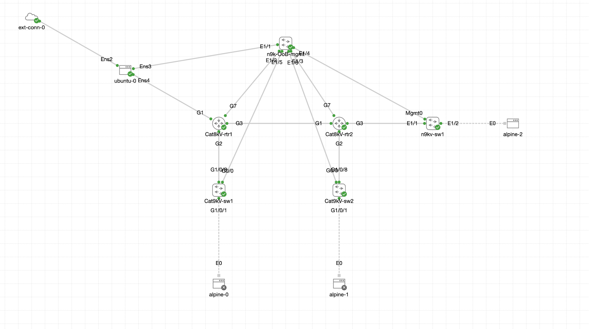

# Automation Day - Practice Files

This repository contains practice labs for the Automation Day event hands-on experience.  The sample diagram for the lab can be found below for reference.

The content is broken up into the following sections:

1. **Section_1-Prepare_CML_Lab_Config**
  * Section 1 is where the Ansible inventory and the lab file for Cisco Modeling Labs are generated.  Contained within the directory is an inventory directory with a lab_values.yaml file.  The IP addressing in this file is designed allow you to start a lab at day 1 (management access only).  The lab contains a Ubuntu (Linux) host that you can access via SSH or using Remote-SSH extension in Visual Studio code.  The Ubuntu host requires internet access to complete deployment of the lab.

2. **Section_2-Simple_API_Demo**
  * Section 2 contains preconfigured application programming interface (API) calls and environment variables that can be imported to Postman.  These files will allow exploration of the CML API including authentication steps, uploading a lab file, starting a lab, and verifying operation.

3. **Section_3-Ansible_Labs**
  * Section 3 is broken up into six labs.  Each lab builds upon the next to create a fully operational network.  The final lab validates that all functionality has been integrated into the CML lab.

Each section contains a dedicated ReadMe that further explains how the content in that section/lab works.

## Outcomes

Customers attending this event will learn how to leverage Ansible, and Postman to configure their lab environments.  The network environment will be provisioned entirely through the use of Ansible's built in modules.  The Ansible lab will demonstrate:

* How to build and work with an Ansible inventory
* Using Ansible's CLI modules to run native CLI commands
* Using Ansible's configuration modules to setup interfaces, NTP, banners, etc
* Understand Ansible playbook structure and considerations for building playbooks.
* Creating playbooks that support both NX-OS and IOS-XE platforms
* Creating playbooks to perform 'show' commands and view the output.

## Credentials

The username and password for all switches and linux hosts in this lab are as follows:

* Username: netops
* Password: netops_admin