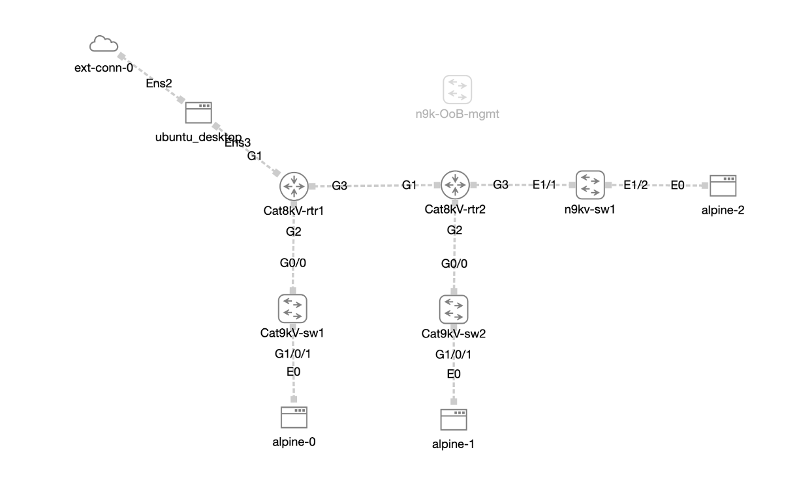

# Automation Day - Practice Files

This repository contains practice labs for the Automation Day event hands-on experience.  The lab file for Cisco Modeling Labs is provided in the cml_lab_config directory, along with a file to deploy your own IP address structure to the lab.  The sample diagram for the lab can be found below for reference.

## Outcomes

Customers attending this event will learn how to leverage Ansible, and Postman to configure their lab environments.  The network environment will be provisioned entirely through the use of Ansible's built in modules.  The Ansible lab will demonstrate:

* How to build and work with an Ansible inventory
* Using Ansible's CLI modules to run native CLI commands
* Using Ansible's configuration modules to setup interfaces, NTP, banners, etc
* Creating playbooks that support both NX-OS and IOS-XE platforms
* Creating playbooks to perform 'show' commands and view the output.

Upon completion of the Ansible lab, customers will utilize Postman to view configuration using the RESTconf interfaces on NX-OS and IOS-XE.