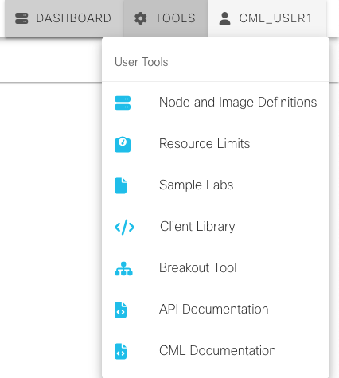

# Basic of working with APIs

An Application Programming Interface (API) provides an interface by which we can directly interact with the software or network devices.  Cisco Modeling Labs contains an API that allows you to interact and control functionality within the lab environment.  The API can be accessed from within the CML tool, under Tools -> API Documentation (see image below) .  The API contains an extensive list of functions that allow you to create, delete, update, and stop/start the labs, nodes, links, and other functions of the CML server.  The goal of this lab is to give you hands on experience with simple API calls

## Folder Structure

* Postman_Import - Contains the environment and collections for import to Postman for running this lab.  Instructions to import are below.
* yaml2json.yaml - This is an Ansible playbook to conver the automation_day_lab.yaml file to a JSON file which we will use to import into CML.

## Importing the Postman files

1. Launch postman
2. When the workspace loads, you should see My Workspace and Collections/Environment/History to the left.  If this is not expanded click collections.  This will expose an import button.
3. Click Import
4. From the import window, choose "folders"
5. Navigate to the Postman_Import folder in this repository, and select open.
6. You will be prompted to import an Environment and Collection, select Import.
7. The Collection and Environment will populate to your workspace.

**Demo of Actions**

